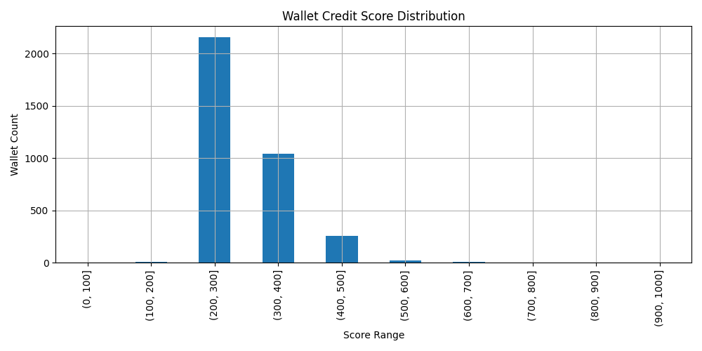

#  Aave Wallet Credit Score Analysis

This file contains the post-scoring analysis of the wallet credit scores generated using `score_wallets.py`. A total of **3,497 wallets** were analyzed based on their interaction history with the Aave V2 protocol.

---

##  Score Distribution Chart

The above chart displays how wallet credit scores are distributed across the range of 0 to 1000.

---

## 🔢 Score Range Buckets

| Score Range | Wallet Count | Observations |
|-------------|--------------|--------------|
| **0 - 100**   |  Many wallets fall here; most had 1–2 transactions only, often `deposit` or `redeem` with no repayment |
| **100 - 200** |  Slightly better, but mostly inactive or liquidated |
| **200 - 400** |  Mixed usage, some repayments, not highly active |
| **400 - 700** |  Good users: active across several actions, no liquidation |
| **700 - 1000**|  Strong behavior: high repay ratios, no liquidations, high activity |

---

## 📊 Score Summary Statistics

| Metric        | Value        |
|---------------|--------------|
| Total Wallets | 3,497        |
| Mean Score    | ~23.47       |
| Median Score  | ~14.90       |
| Max Score     | 1000         |
| Min Score     | 0            |
| Std Dev       | ~23.36       |

> 🔎 Note: Most wallets received scores below 100, indicating either limited interaction or risky behavior.

---

## 🧠 Behavior Analysis

###  Low Scoring Wallets (0–100)
- Many had only 1 transaction: `deposit` or `redeemunderlying`
- Almost zero activity beyond that
- High liquidation rate or no repayments

###  High Scoring Wallets (700+)
- High number of actions across multiple days
- Good `repay_ratio` and `redeem_ratio`
- No liquidation calls
- Typically repaid borrowings and actively participated in lending

---

##  Conclusion

This credit scoring system provides a **data-driven**, transparent, and extendable method to assess DeFi wallet behavior. It can help:
- Identify trusted users
- Flag risky or bot-like addresses
- Serve as input for DeFi protocol risk models or governance decisions

Further improvements can include:
- Time-decay on activity
- Transaction volume normalization
- Token-specific behavior scoring
